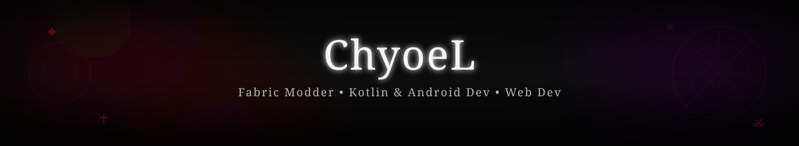
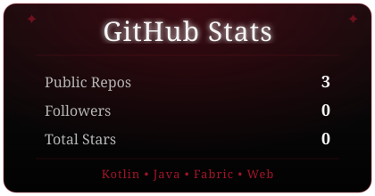

 

## ⚔️ About Me

Developer yang bergerak di dunia **game modding**, **Android development**, dan **web development** — dengan sentuhan estetika gelap di setiap karya.

- 🛠️ Sedang membangun mod **Minecraft Fabric**
- 📱 Mengembangkan aplikasi Android dengan **Kotlin**
- 🎨 Membuat website dengan nuansa **gothic**
- 🌙 Selalu suka hal-hal dengan tema *dark aesthetic*

 

## 🩸 Tech Stack

 

## 🏰 Featured Projects

<table>
<tr>
<td width="50%">

### 🎯 Spawner Tracker
Client-side HUD mod untuk **Minecraft Fabric** (target versi 26.1.2) — menampilkan info spawner secara real-time langsung di layar.

`Kotlin` `Java` `Fabric API`

</td>
<td width="50%">

### 🕸️ Gothic Profile Website
Website profil personal dengan tema **hitam-violet gothic** — hero section, about, games, dan music player custom bergaya Spotify.

`HTML` `CSS` `JavaScript`

</td>
</tr>
</table>

 

 

## 🖤 Connect

— *forged in darkness, coded in violet* 🕯️
